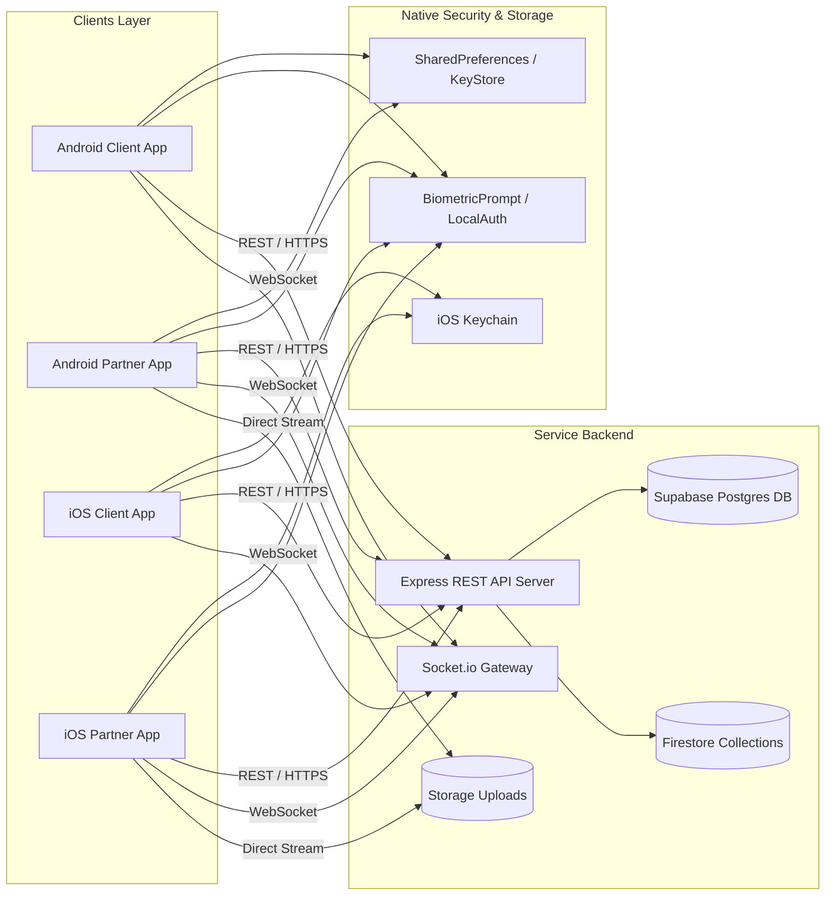

# Architecture Diagram

Visual representation of Orbit's production multi-tier native architecture.

---

```mermaid
graph LR
    subgraph Clients Layer
        A1[Android Client App]
        A2[Android Partner App]
        I1[iOS Client App]
        I2[iOS Partner App]
    end

    subgraph Native Security & Storage
        AS1[SharedPreferences / KeyStore]
        IS1[iOS Keychain]
        BC[BiometricPrompt / LocalAuth]
    end

    subgraph Service Backend
        EX[Express REST API Server]
        WS[Socket.io Gateway]
        PR[(Supabase Postgres DB)]
        FS[(Firestore Collections)]
        S3[(Storage Uploads)]
    end

    A1 --> AS1
    A2 --> AS1
    I1 --> IS1
    I2 --> IS1

    A1 --> BC
    A2 --> BC
    I1 --> BC
    I2 --> BC

    A1 -->|REST / HTTPS| EX
    A2 -->|REST / HTTPS| EX
    I1 -->|REST / HTTPS| EX
    I2 -->|REST / HTTPS| EX

    A1 -->|WebSocket| WS
    A2 -->|WebSocket| WS
    I1 -->|WebSocket| WS
    I2 -->|WebSocket| WS

    EX --> PR
    EX --> FS
    A2 -->|Direct Stream| S3
    I2 -->|Direct Stream| S3
```
