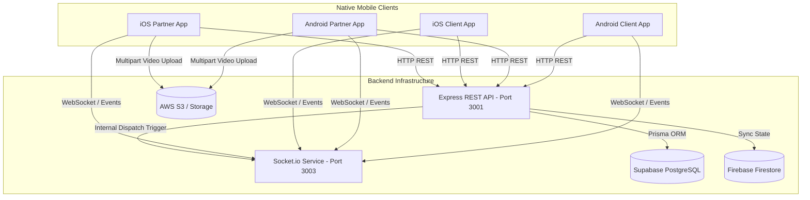

# Dependency Graph

Architecture and service relationship mapping for the Orbit platform.

---

```mermaid
graph TD
    subgraph Native Mobile Clients
        AC[Android Client App]
        AP[Android Partner App]
        IC[iOS Client App]
        IP[iOS Partner App]
    end

    subgraph Backend Infrastructure
        API[Express REST API - Port 3001]
        WS[Socket.io Service - Port 3003]
        DB[(Supabase PostgreSQL)]
        FS[(Firebase Firestore)]
        S3[(AWS S3 / Storage)]
    end

    AC -->|HTTP REST| API
    AP -->|HTTP REST| API
    IC -->|HTTP REST| API
    IP -->|HTTP REST| API

    AC -->|WebSocket / Events| WS
    AP -->|WebSocket / Events| WS
    IC -->|WebSocket / Events| WS
    IP -->|WebSocket / Events| WS

    API -->|Prisma ORM| DB
    API -->|Sync State| FS
    API -->|Internal Dispatch Trigger| WS
    AP -->|Multipart Video Upload| S3
    IP -->|Multipart Video Upload| S3
```
